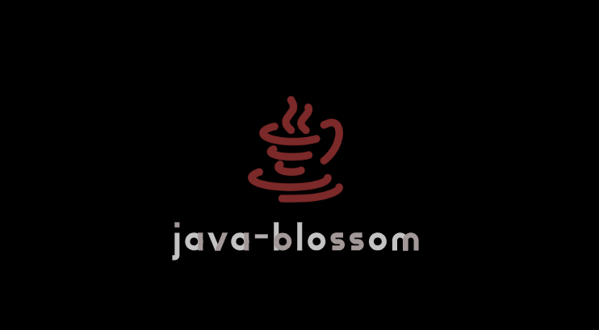

# Java Blossom

Java Blossom is a powerful Java library that serves as a comprehensive toolbox for developers, encompassing a range of hand-made libraries and utilities. It is designed to empower Java developers to code better and faster, providing solutions for various common tasks.

## Included Libraries

Java Blossom comes with the following hand-made libraries:

- **Web MVC Framework:** Adopt the Model-View-Controller pattern for organizing your web applications efficiently.

- **ORM Library:** Simplify database interactions and data persistence with the integrated Object-Relational Mapping library.

- **File Treatment Utilities:** Efficiently handle file operations, including reading, writing, and executing actions on files.

- **Convenient Helpers:** Boost productivity with various helper classes, such as date helpers, class helpers, and more.

- **Data Summarization and Averaging:** Analyze data effectively with tools to summarize, average, and manipulate data.

## Installation

To use Java Blossom in your Java project:

- Download Java-blossom JAR: Download the JAR file from the [releases page]() and add it to your project's classpath.

- Build from source: Clone the repository and build the JAR file using Maven.

## Usage

To use Java Blossom in your Java project:

- Import the library: Import the library in your Java project.

- Use the library: Use the library in your project by calling the various methods and classes.

## Documentation

The documentation for Java Blossom is available at [https://java-blossom.github.io/](https://java-blossom.github.io/).
